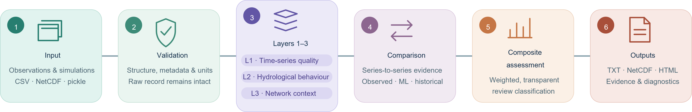

<p align="center">
  
</p>

<p align="center">
  <strong>A Three-Layer Verification Framework for Streamflow Anomaly Detection</strong>
</p>

<p align="center">
  
  
  
  
</p>

TriHydrA screens long streamflow records for data-quality concerns,
hydrological behaviour and network context. It is intended to help users find
records that deserve inspection—not to automatically declare observations or
simulations erroneous.

## What can TriHydrA do?

- Assess one observed or simulated streamflow series.
- Compare observation–model, observation–observation or model–model series.
- Compare a selected period with another period from the same record.
- Run one station, a station list or every compatible station in a dataset.
- Run the complete assessment or only selected checks.
- Add optional context from nearby gauges and comparable catchments.
- Produce readable TXT reports, structured NetCDF results and interactive
  HTML diagnostics.

| Layer | Question |
|---|---|
| **Layer 1 · Time-series quality** | Does the record contain intrinsic quality or temporal-consistency concerns? |
| **Layer 2 · Hydrological behaviour** | What signatures and high-flow behaviour does the record exhibit? |
| **Layer 3 · Network context** | Is that behaviour supported by relevant neighbouring or comparable gauges? |

## How it works

<p align="center">
  
</p>

TriHydrA keeps the raw input record intact. Scientific checks consume a
canonical pandas time series, so the Layer 1–3 calculations remain separate
from file-format-specific readers and output writers.

## Install

From the repository folder:

```bash
conda env create -f environment.yml
conda activate trihydra
python -m pip install -e .
```

The environment includes JupyterLab, Jupyter Notebook and the packages needed
for NetCDF and interactive HTML output.

## Run

Edit the single root configuration file, [`trihydra.toml`](trihydra.toml), and
then run:

```bash
trihydra run --config trihydra.toml
```

The same configured workflow can be called from Python or Jupyter:

```python
from trihydra import run_batch

results = run_batch("trihydra.toml")
```

Prepared pandas series can also be assessed directly with `run_trihydra()` or
`run_trihydra_network()`.

## Inputs and outputs

| Supported inputs | Configurable outputs |
|---|---|
| Station-by-time NetCDF | Per-station TXT reports |
| Wide CSV | Per-station NetCDF files |
| Trusted AIFL long-term result pickles | Network NetCDF summary |
| Prepared pandas series | Interactive HTML diagnostics |
| Optional station context CSV | Run log |

NetCDF4 and HDF5-backed NetCDF files are supported through the available
`netcdf4` and `h5netcdf` engines. Pairwise comparison requires compatible unit
labels; TriHydrA does not silently convert discharge units.

## Why plausibility screening?

Streamflow records may contain missing periods, negative values, duplicated or
irregular timestamps, plateaus, isolated spikes, abrupt level changes and
long-term drift. Other records may be internally consistent but hydrologically
unusual when compared with another series or with relevant gauges.

## Documentation

Detailed documentation is available in [`docs/`](docs/):

- [Configuration guide](docs/TRIHYDRA_CONFIGURATION.md)
- [Layer 1 diagnostics](docs/LAYER1_DIAGNOSTICS.md)
- [Layer 2 hydrological signatures and comparison](docs/LAYER2_HYDROLOGICAL_SIGNATURES.md)
- [Layer 3 network context](docs/LAYER3_NETWORK_CONTEXT.md)
- [NetCDF output structure](docs/NETCDF_SCHEMA.md)
- [Example-data notes](data/README.md)
- [Complete fictional notebook example](example/trihydra_example.ipynb)

The notebook example uses four small fictional stations and demonstrates the
full Layers 1–3 and comparison workflow, interactive HTML diagnostics, and
NetCDF exploration without requiring the larger example datasets.

## Important limitations

- A review classification requests inspection; it is not proof of erroneous
  data.
- Default thresholds are configurable screening rules, not universal
  hydrological laws.
- Layer 3 requires multiple loaded observation series and matching station
  metadata.
- A context metadata row alone does not load a station's time series.
- Pickles can execute code and must only be loaded from trusted sources.

## AI-assisted development

Parts of TriHydrA's implementation, refactoring, testing, documentation and
visual design were developed with assistance from OpenAI Codex and ChatGPT,
Anthropic Claude, and Google Gemini. Scientific decisions, threshold
selection, validation and final review were performed by the project author.
AI-assisted codes were reviewed and revised before inclusion.

## Project and citation

TriHydrA was developed for the **ECMWF Code for Earth Challenge 2026**.

## Licensing

An open-source software licence will be added before public release.
